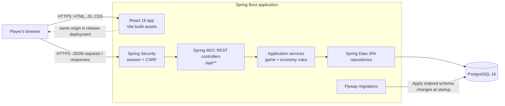
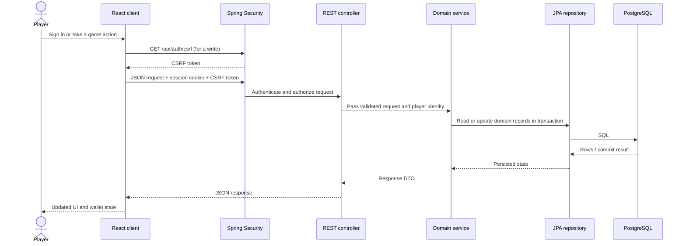

# LootVault System Design

LootVault is a full-stack browser game for collecting gear, opening crates, and playing short games for in-game currency. The application is organized as a single Spring Boot service with a React client and PostgreSQL persistence. The backend is the authority for player identity, game outcomes, inventory, and currency changes.

## Goals and scope

- Provide a responsive browser interface for the game's collection and play loops.
- Keep account, wallet, crate, shop, and progression state durable in PostgreSQL.
- Apply game and economy rules on the server so clients cannot directly set balances or rewards.
- Keep deployment straightforward for an MVP: one web application and one relational database.

The current product includes Blackjack and The River, crates and banners, daily rewards, a shop, inventory, quests, collections, onboarding, and a practice sandbox. It is an MVP in progress, not a claim of production-scale capacity.

## High-level architecture

In the release build, the compiled React assets are packaged into the Spring Boot JAR and served by the same application as the API. This gives the browser and API a same-origin deployment, which fits the app's session-cookie authentication. During local development, Vite serves the frontend separately and proxies `/api` requests to Spring Boot.

## Main runtime request flow

Read requests use the session cookie. Write requests first obtain a session-bound CSRF token and send it with the mutation. If the session expires, the API returns `401`, and the client signals the UI to return the player to authentication.

## Backend responsibilities

The backend follows a controller → service → repository structure:

- **Controllers** expose HTTP endpoints and translate requests and responses. Examples include authentication, earning, crates, openings, banners, shop, wallet, inventory, and progression.
- **Services** implement the rules and coordinate changes. `EarnLootService` and `CardGameEngine` handle game rounds; `CrateService`, `OpeningService`, and `PityService` coordinate crate openings and banner odds; `WalletService`, `GemService`, and `ShopService` manage currency and purchases; `QuestService` and `CollectionService` manage progression.
- **Repositories and entities** persist players, wallets, ledger entries, catalog items, inventory, crates, pity counters, collections, and quests using Spring Data JPA.
- **DTOs** define the API boundary rather than exposing persistence entities directly.
- **Transactions** wrap state-changing service operations so related database writes succeed or fail together.

The browser presents the game and collects player actions. It calls APIs for authoritative state changes; it does not write database records or submit a wallet balance as the source of truth.

## Data and consistency

PostgreSQL stores the durable player and game state. The main relationships include a player and their wallet, owned items and crates, currency ledger entries, progression records, and pity counters. Flyway applies versioned SQL migrations in `src/main/resources/db/migration`; Hibernate is configured to validate the schema rather than create it automatically.

Currency and reward operations need to preserve invariants such as non-negative balances, ownership checks, and a reward being granted only when its qualifying action succeeds. Service-level transactions and database constraints support these rules. Some purchase and opening operations accept request IDs to support safe retries; durable idempotency coverage should be assessed per operation before treating the API as exactly-once.

## Security boundaries

- Spring Security authenticates players with server-side HTTP sessions.
- Session cookies are configured as secure, HTTP-only, and `SameSite=Lax` in the production profile.
- CSRF protection is enabled for state-changing requests; the React API client fetches and sends the token.
- Player identity comes from the authenticated server session. Protected endpoints require authentication.
- Administrative wallet credit endpoints are denied by the web security configuration.
- The developer login is disabled in the production profile.
- Database credentials and deployment-specific configuration are supplied through environment variables, not committed to the repository.

The production profile expects HTTPS and a database connection configured with `DB_URL`, `DB_USERNAME`, and `DB_PASSWORD`. The developer profile and local secrets are for local use only.

## Deployment shape

The repository's Dockerfile builds the Vite frontend, packages it with the Spring Boot application, and runs the resulting JAR in a Java 21 runtime image. A typical deployment therefore has:

1. One Spring Boot web service that serves both the React app and `/api/**`.
2. One managed PostgreSQL database, with its connection details provided to the web service.
3. HTTPS at the hosting platform or reverse proxy.
4. Persistent database backups and a restore procedure appropriate to the value of player data.

Set `SPRING_PROFILES_ACTIVE=prod` on the host. The production profile maps the host-provided `PORT` environment variable to Spring's listening port and turns on production cookie settings. Flyway runs schema migrations during application startup, so deployments should be coordinated with backward-compatible migration practices as the app grows.

For a split frontend/backend deployment, set `FRONTEND_ORIGINS` to the exact frontend origin(s), and configure the client API base URL and cross-origin cookie behavior deliberately. Same-origin hosting is the current release design and requires less CORS and cookie configuration.

## Reliability and growth considerations

The current design favors a compact, understandable MVP. It has no separate worker tier, message broker, cache, or multi-region database in the documented architecture. The Spring application and PostgreSQL database are potential single points of failure in a one-instance deployment.

Before a public launch, prioritize:

- Automated database backups and a tested restore.
- Login rate limiting and deployment-specific browser checks.
- Auditing idempotency and concurrency behavior for purchases, claims, and openings.
- Health monitoring, structured logs, and alerts for API and database failures.
- Capacity checks for JVM memory, database connections, and concurrent requests.

If usage grows, measure first. Likely next steps are a larger application instance, connection-pool tuning, a separately managed database with stronger backup and recovery guarantees, and only then adding caches or background workers where a measured need exists.

## Technology summary

| Area | Current technology |
|---|---|
| Frontend | React 19, JavaScript, Vite 8, React Router |
| Backend | Java 21, Spring Boot 4.1, Spring MVC, Spring Security |
| Persistence | PostgreSQL 16, Spring Data JPA, Hibernate |
| Schema evolution | Flyway SQL migrations |
| Packaging | Docker multi-stage build; frontend assets served by Spring Boot |
| Local database | Docker Compose |
